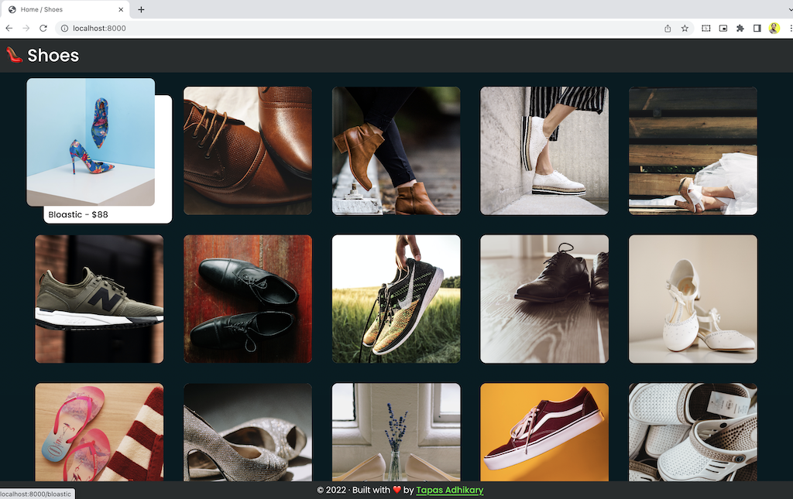
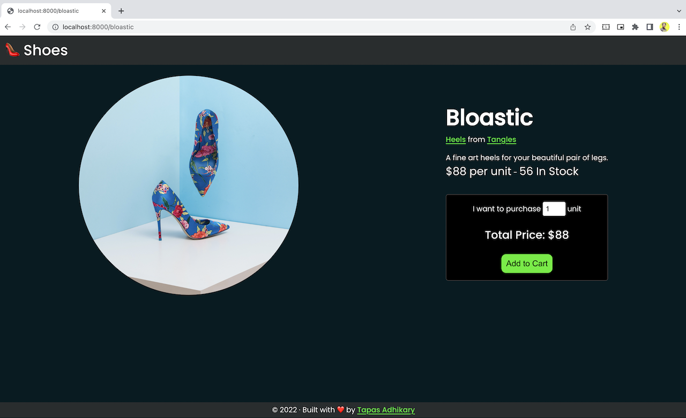

# 👠 shoes

`shoes` is an online shoe store built using Gatsby and Strapi. It is an `Open Source` project built to learn how to use `Gatsby` and `Strapi` to build a static site.

## What is `shoes`?

`shoes` is a shoe store that sells shoes. It lists shoes by brand, style, and price. You can see the details of each shoe by clicking on the shoe image.

The shoe details include the brand, style, price, and description. You can add the shoe to your cart by clicking on the "Add to Cart" button.

### Many Thanks to all the `Stargazers` who have supported this project with stars(⭐)

## How to run the app locally?

To run the app locally,

- First fork and clone the repository.
- Then change to the directory where the repository is cloned.
- The project has two folders, `client` and `datastore`.
- Change to the `datastore` folder.
- Run `npm install` or `yarn` to install the dependencies.
- Run the `yarn develop` to start the strapi in the development. You can access the console using the URL `localhost:1337`.
- Now change to the `client` folder.
- Run `npm install` or `yarn` to install the dependencies.
- Run the `gatsby develop` to start the gatsby in the development. You can access the console using the URL `localhost:8000`.

## Contribute and Learn More

It is and Open Source project. You can [contribute](CONTRIBUTING.md) to the project. Don't worry if you do not know much about Gatsby or Strapi. A basic knowedge on the ReactJS will help you to get started.

You can reach out to me on 

- [Twitter](https://twitter.com/tapasadhikary)
- [Showwcase](https://www.showwcase.com/atapas398)

